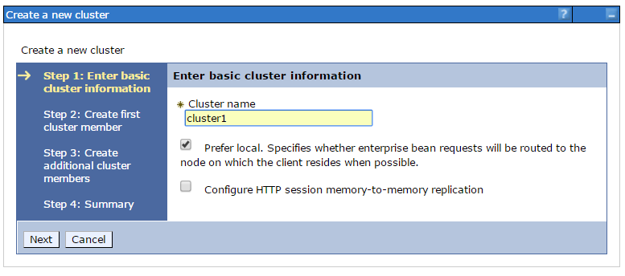
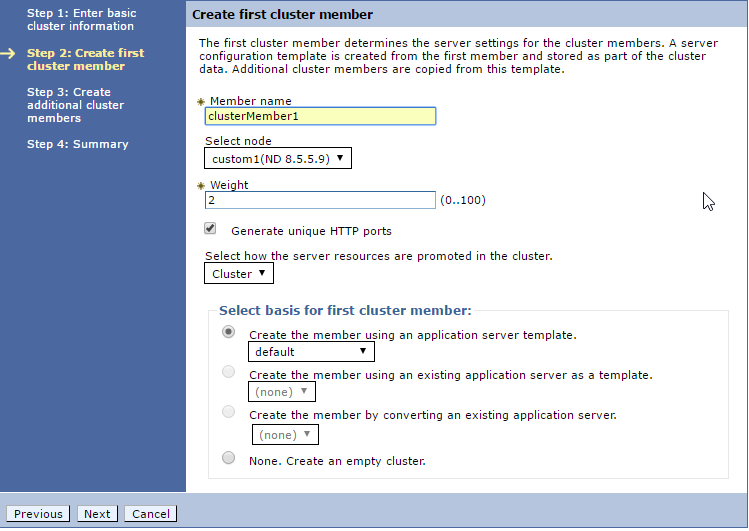
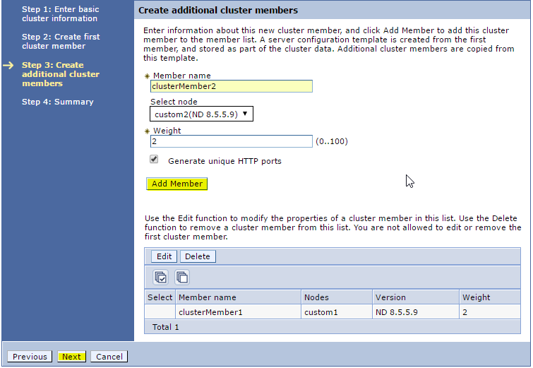
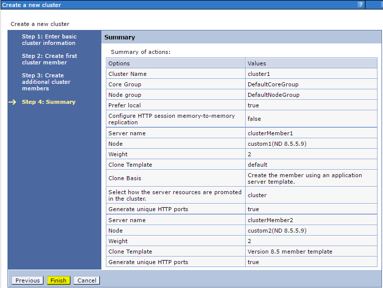
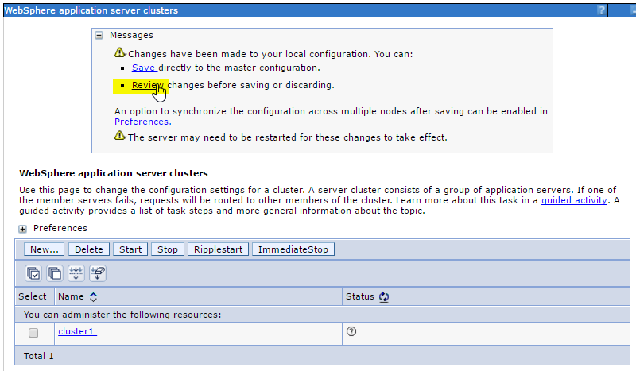
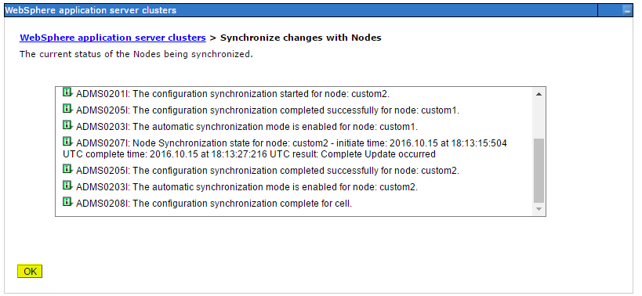
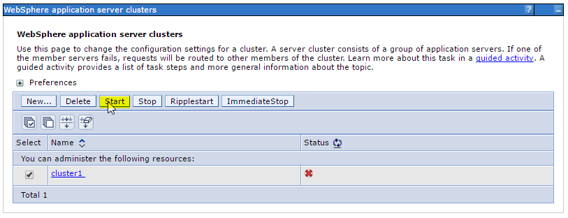
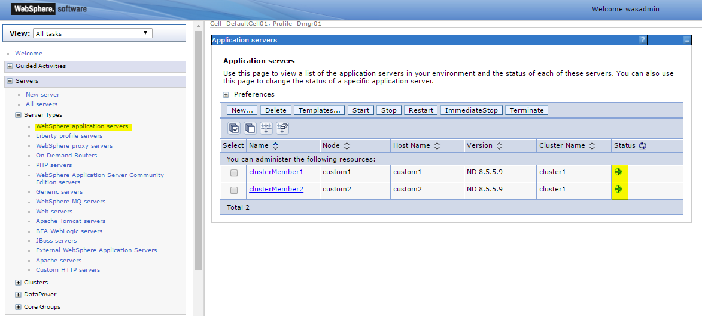

# Websphere Application Server Network Deployment 2-Node Cluster on Docker
# Written by Amir Barkal, inspired by [Dockerfiles for WebSphere Application Server traditional](https://github.com/WASdev/ci.docker.websphere-traditional)
======================================================================================================
## What is this?

This is a bunch of dockerfiles and docker-compose yaml files to get you started quickly with WebSphere Application Server Network Deployment cluster.
The purpose of this project is to easily create a 2 node cluster with a custom WAS profile, running on 3 Docker containers:
* Deployment Manager (dmgr)
* Custom node 1 running an application server (custom1)
* Custom node 2 running an application server (custom2)

NOTE: At the moment the cluster needs to be manually created from ISC, after the
  cell has been initialized.

## What is it good for?
Testing, demonstration, learning and POC.

## Prerequisites:
* Git-Bash with Administrator privileges 
* Docker-tools with minimum engine version 1.12.0
* Docker Hub account with access to download the base nd image. (`docker login -u USERNAME -p PASSWORD`). Alternatively, you can build your own nd image [as per described here](https://github.com/WASdev/ci.docker.websphere-traditional/tree/master/network-deployment/install). Make sure you change the image name in the `FROM` block inside dmgr/Dockerfile and custom/Dockerfile to match the one you built.

## How do I run it?
1. Clone this repo `git clone http://gitlab.webtech-inv.com:81/amirb/websphere-nd-docker.git`
2. Change to the repo dir `cd websphere-nd-docker`
3. Execute `docker-compose up -d`
4. Wait for it... (Can take up to 20 minutes depending on the speed of your internet connection and CPU)
   You can check containers status with `docker stats`. When CPU activity is around 0% your cluster is ready!

## How do I access it?
Open `http://DOCKER_HOST:9060/admin`
Security is off, so use whatever login name you like.

## How do I create the cluster?
Open ISC and enter random username. (i.e. `wasadmin`)

1. Go to `Servers >> Clusters >> WebSphere application server clusters >> New`

2. Enter cluster name, keep default options and hit `Next`

3. Add the first cluster member to node custom1, again keeping all default options and click `Next`

4. Add the second cluster member to node custom2 and click `Add Member`

5. Review the summary and hit `Finish`

6. Click `Review`

7. Make sure `Synchronize changes with Nodes` is selected and then click `Save`

8. Wait for configuration synchronization to complete before clicking `OK`

9. Start the cluster by selecting it from the list and hit `Start`

10. Wait for the 2 application server JVMs to load. You can check their status in 
`Servers >> Server Types >> WebSphere application servers`

## To Do:
* Automate cluster creation upon cell initialization

## Technical Details:

   + Current version level is:

     * IBM Java 7.1.30
     * Websphere Application Server ND 8.5.5 Fix Pack 9
     * Installation Manager 1.6.2

   + The following IBM part numbers and source files were used to construct the image:

     * 7.1.3.30-WS-IBMWASJAVA-part1.zip
     * 7.1.3.30-WS-IBMWASJAVA-part2.zip
     * (CIK2HML) WASND_v8.5.5_1of3.zip
     * (CIK2IML) WASND_v8.5.5_2of3.zip
     * (CIK2JML) WASND_v8.5.5_3of3.zip
     * (CIK2GML) Install_Mgr_v1.6.2_Lnx_WASv8.5.5.zip
     * 8.5.5-WS-WAS-FP0000009-part1.zip
     * 8.5.5-WS-WAS-FP0000009-part2.zip

## Commands:

* `docker build -t amirb/portal:appserver1 --build-arg PROFILE_NAME=AppSrv01 --build-arg NODE_NAME=ServerNode --build-arg HOST_NAME=appserver1 .`
* `docker build -t amirb/portal:appserver2 --build-arg PROFILE_NAME=AppSrv02 --build-arg NODE_NAME=ServerNode --build-arg HOST_NAME=appserver1 .`
* `docker build -t amirb/portal:dmgr .`

* `docker run --name dmgr -h dmgr --net=cell-network -p 9060:9060 -d amirb/portal:dmgr`
* `docker run --name appserver1 -h appserver1 --net=cell-network -p 9080:9080 -e HOST_NAME=appserver1 -e PROFILE_NAME=AppSrv01 -e NODE_NAME=ServerNode1 -e DMGR_HOST=dmgr -e DMGR_PORT=8879 amirb/portal:appserver1`
* `docker run --name appserver2 -h appserver2 --net=cell-network -p 9081:9080 -e HOST_NAME=appserver2 -e PROFILE_NAME=AppSrv02 -e NODE_NAME=ServerNode2 -e DMGR_HOST=dmgr -e DMGR_PORT=8879 amirb/portal:appserver2`

* `./wsadmin.sh -lang jython -conntype SOAP -host dmgr -port 8879 -c "AdminControl.completeObjectName('cell=ServerCell,node=ServerNode,name=appserver1,type=Server,*')"`

SOAP client properties file
/opt/IBM/WebSphere/AppServer/profiles/Dmgr01/config/cells/DefaultCell01

/opt/IBM/WebSphere/AppServer/bin/wsadmin.sh -lang jython -conntype SOAP -host dmgr -port 8879 -c "AdminTask.listNodes('[-nodeGroup DefaultNodeGroup ]')" |grep custom

## Add Node
`docker run --name custom5 -h custom5 --net=webspherenddocker_default -e PROFILE_NAME=custom -e NODE_NAME=custom5 -e DMGR_HOST=dmgr -e DMGR_PORT=8879 amirb/portal:custom`

## Cluster

`AdminTask.createCluster('[-clusterConfig [-clusterName cluster1 -preferLocal true]]')`

`AdminTask.createClusterMember('[-clusterName cluster1 -memberConfig [-memberNode custom1 -memberName clusterMember1 -memberWeight 2 -genUniquePorts true -replicatorEntry false] -firstMember [-templateName default -nodeGroup DefaultNodeGroup -coreGroup DefaultCoreGroup -resourcesScope cluster]]')`

`AdminTask.createClusterMember('[-clusterName cluster1 -memberConfig [-memberNode custom2 -memberName clusterMember2 -memberWeight 2 -genUniquePorts true -replicatorEntry false]]')`

`AdminConfig.save()`

`AdminControl.invoke('WebSphere:name=DeploymentManager,process=dmgr,platform=common,node=DefaultNode01,diagnosticProvider=true,version=8.5.5.9,type=DeploymentManager,mbeanIdentifier=DeploymentManager,cell=DefaultCell01,spec=1.0', 'multiSync', '[false]', '[java.lang.Boolean]')`

`AdminControl.invoke('WebSphere:name=cluster1,process=dmgr,platform=common,node=DefaultNode01,version=8.5.5.9,type=Cluster,mbeanIdentifier=cluster1,cell=DefaultCell01,spec=1.0', 'start')`
